# Mee-Fan

**[mee-fan.com](https://mee-fan.com)**

**中文** · [English](#english)

<p align="center">
  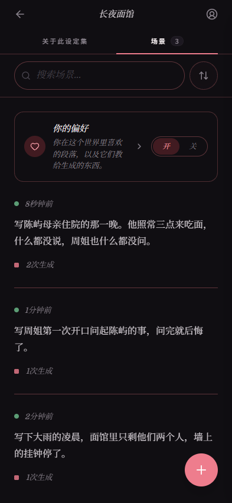
  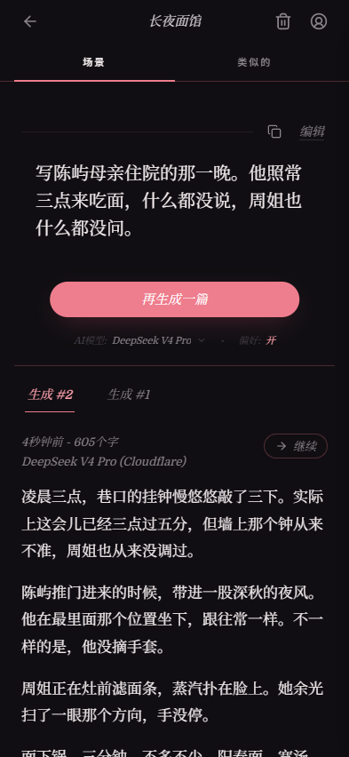
  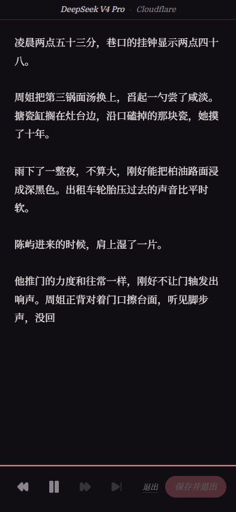
</p>

---

<a id="中文"></a>

## 中文

[三个概念](#三个概念) · [使用流程](#使用流程) · [写场景](#写场景) · [阅读](#阅读) · [偏好](#偏好) · [附加设定](#附加设定) · [设定集的版本](#设定集的版本) · [问问](#问问) · [查找](#查找) · [它不是什么](#它不是什么) · [本地运行](#本地运行)

Mee-Fan 是一个私人的 AI 小说写作与阅读工具。

你用自己的话描述一个设定，在它之上写一个场景，故事就会实时生成出来。没有分享、没有浏览、没有推荐——你做的一切只属于你自己，整个 app 都是照着手机阅读做的。

### 三个概念

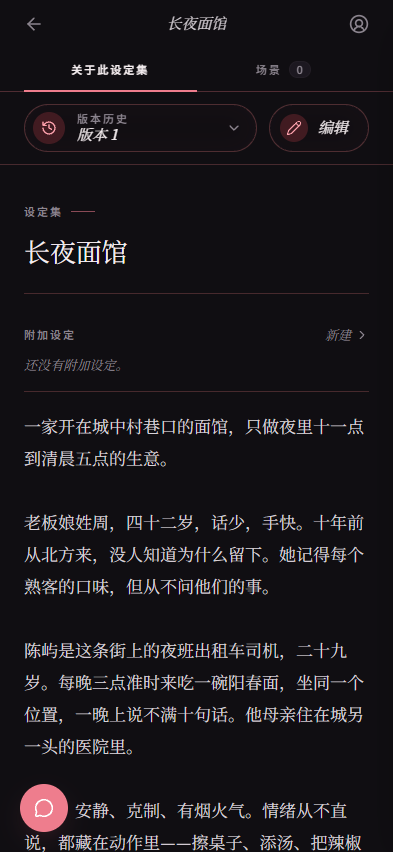

**设定集（World）**——你要写的那个世界。人物、语气、关系、反复出现的细节，凡是生成时该知道的都写进去。它是一段自由的文字，不是表格。花五分钟就够开始了；读过几篇之后你自然知道缺什么，再回来补。

**场景（Scene）**——设定集里某一个具体的情境。不是一次性的提问，而是一份*配方*。车里的那场争执。拖堂的那节课。什么将要发生却还没发生的那一刻。场景写一次就够，之后想把同一个设定再读一遍另一种写法，回来点它就是。

**生成（Take）**——一个场景的一次生成。明天再跑同一个场景，出来的会是另一版：节奏不同、着力点不同、转折不同。值得读的前提通常不止值得读一次，而第一次生成很少就是最好的那次。

> 代码里它们叫 `worlds`、`prompts`、`pieces`。界面上的叫法定义在 `src/config.ts`（`ENTITY_LABELS`），改那里就全站生效。本文只在谈代码时用代码里的名字。

<br clear="all">

### 使用流程

打开设定集 → 选一个场景 → 生成 → 阅读。如果你心里已经有个还不存在的想法，直接新建一个场景写下来。

app 里其余的一切，都是为了让这四步中的某一步更好。

### 写场景

四种写法，最后都落在同一个编辑器里：

- **自己写。** 默认方式；当你已经知道自己想要什么时，它依然最快。
- **AI 构思场景。** 说一两个词，AI 就照着你的设定集写出一个场景。之后一轮轮改——你提过的每条要求都会留成线索，也可以回头改早先那条要求，把后面的稿子重做一遍。
- **类似的。** 从一个你喜欢的场景出发，换一个故事，但要同一种味道——新的情境、新的人、设定集的另一个角落，而不是把原来那条换个说法。新场景记得自己从哪来，所以一个场景能告诉你它启发了哪些。
- **AI 打磨。** 对你手上这条场景过一遍：同一个故事、同一批人，但更利落。说说哪里不对，或者直接让它过一遍。新稿会落回编辑器，原文一点即回（**还原**）。

<p align="center">
  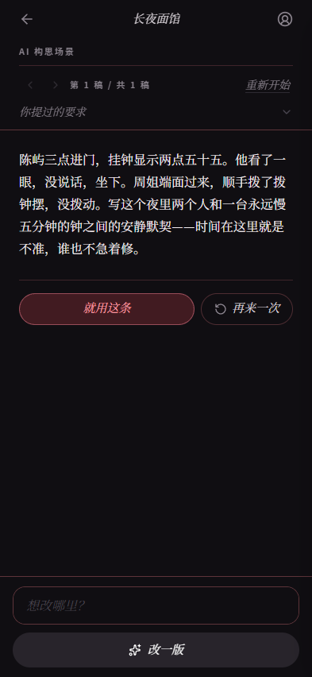
  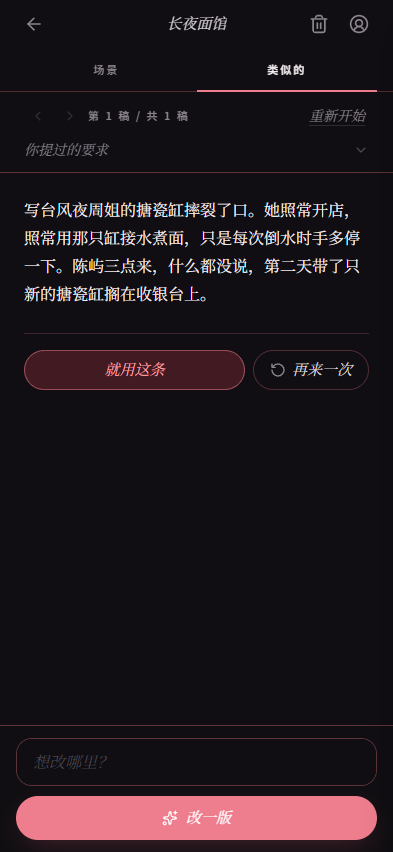
  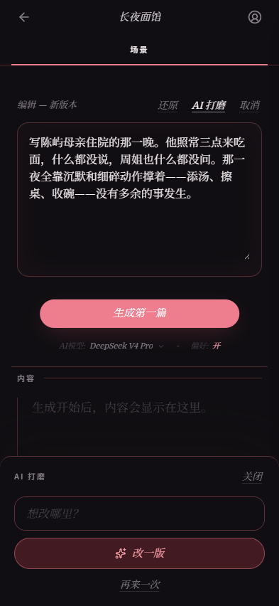
</p>

反复重写的场景会归到同一条场景的**版本**之下，而不是在列表里堆成一串几乎一样的条目，列表始终是一列想法。你可以打开版本记录，对照、切换。

### 阅读

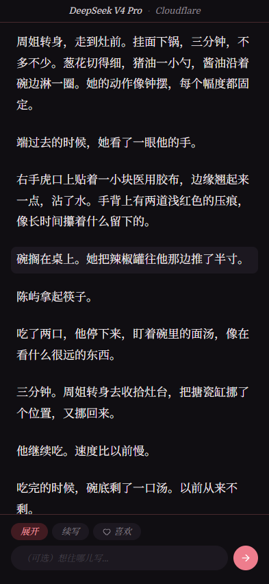

生成是实时流出来的。过程中你可以调慢、调快、暂停，或者直接跳到结尾。

生成中或生成结束后：

- **展开**——把最后那一段摊开来写细。
- **续写**——接着往下写，也可以顺便说一句往哪走。
- **从标记重跑**——每次展开和续写都会在正文里留下一个标记；跳回某个标记，从那里换一条路。

阅读显示（字体、字号）可以随时调，app 有浅色和深色两套。

生成的内容只有你说保存才会保存。保存后的生成挂在它的场景下，可以重新打开继续写，也可以手动编辑。

<br clear="all">

### 偏好

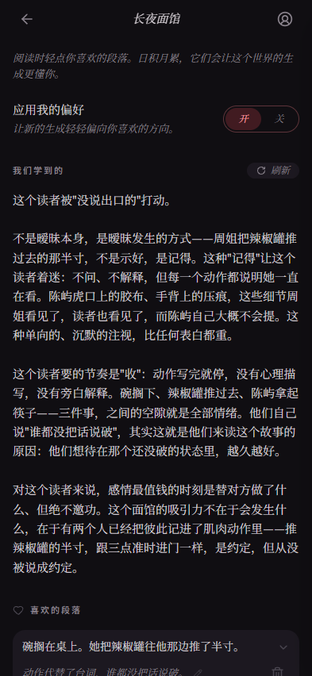

阅读时轻点你喜欢的段落，它就被存下来，还可以顺手写一句哪里戳中你。日积月累，app 会把这些提炼成一小段文字，写清楚你在**这个设定集里**对什么有反应；开启之后，它会回流进新的生成。它是一段散文，不是标签也不是打分，而且按设定集分开存放——你在一个设定里喜欢的东西不会串到另一个。你可以读这段文字，逐条编辑或删除喜欢过的段落，也可以随时刷新。

<br clear="all">

### 附加设定

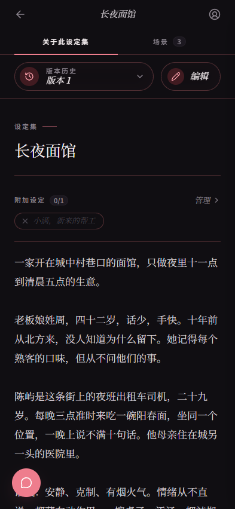

附加设定是一块额外的设定——一个角色、一段关系、一条规则——放在设定集旁边，而不是写进它里面。开启后，它的正文会接在设定集描述的末尾，供之后的生成使用；关掉，设定集就还是原来的样子。

每次生成都会记下当时开着哪些附加设定，场景列表也可以只看用当前这些写出来的。

<br clear="all">

### 设定集的版本

设定集的历史像分支。直接编辑是就地修改；**新版本**会把你的改动存成另一个版本，当前版本原样保留。一个版本拥有它下面的一切——场景、生成、喜欢的段落、附加设定——所以切换版本等于把整个设定集换掉，切回来又原样恢复。

### 问问

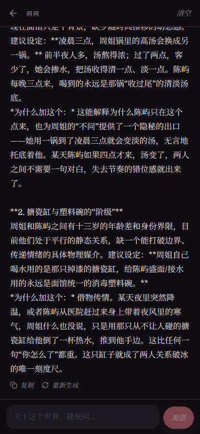

一个只针对某个设定集的对话。问问这个设定缺了什么、某一段读起来如何、某句话该怎么写。它是关于设定集的聊天，不是生成器——你的设定集不会被它改动。

<br clear="all">

### 查找

场景支持全文搜索（模糊匹配，不必记得原话），也可以按最新、最早、生成最多、改写最多排序。新账号会自带几个示例设定集供你上手，随时可以删。

另外：app 是双语的（中英文随时切换），生成时还可以在多个模型里挑一个。

### 它不是什么

- **不是社交。** 没有分享、没有推荐、看不到别人的东西。设定集只属于你的账号。
- **不是仓库。** 生成会保存、可以重读，但这个 app 是围绕新写出来的那一篇做的，不是围绕书架。
- **不是「随便给我来点」按钮。** 你带着想要的东西来，它才好用。

### 本地运行

服务端和工具链都跑在 Bun 上。

```bash
bun install
bun run dev     # API 在 :3001，客户端在 :5173
```

生成和搜索向量需要环境变量 `OPENROUTER_API_KEY`。架构见 `CLAUDE.md`，设计规范见 `DESIGN.md`。

---

<a id="english"></a>

## English

[中文](#中文) · **English**

[The three things](#the-three-things) · [The loop](#the-loop) · [Writing scenes](#writing-scenes) · [Reading](#reading) · [Taste](#taste) · [Additions](#additions) · [Versions of a world](#versions-of-a-world) · [Ask](#ask) · [Finding things](#finding-things) · [What it isn't](#what-it-isnt) · [Running it](#running-it)

<p align="center">
  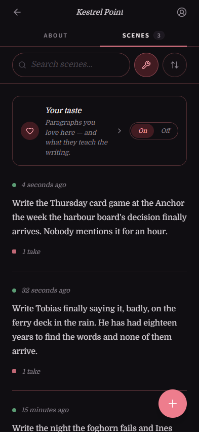
  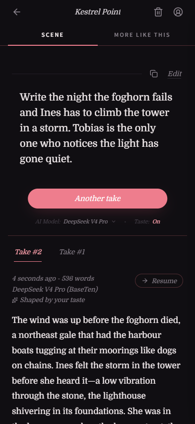
  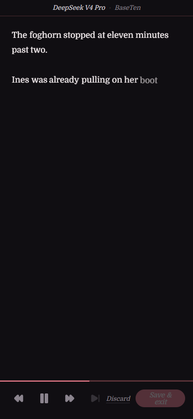
</p>

Mee-Fan is a private app for writing and reading AI fiction.

You describe a setting in your own words, write a scene against it, and the app streams a story back. Nothing is shared, browsed or recommended — everything you make is yours alone, and the whole app is built for reading on a phone.

### The three things

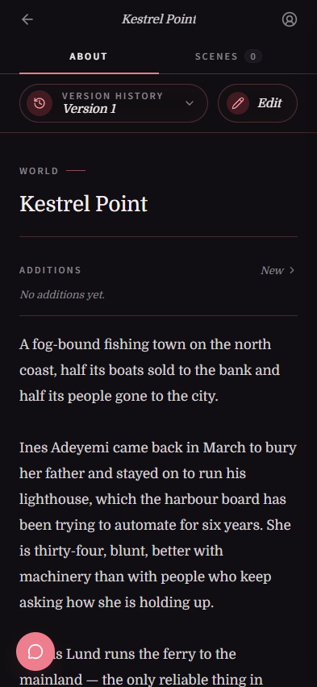

**World** — the setting you're writing in. Characters, tone, relationships, the recurring details, whatever the writing should know. A world is freeform text, not a form. Five minutes of it is enough to start; you learn what's missing after a few reads and come back to add it.

**Scene** — a specific situation inside that world. Not a one-off query — a *recipe*. The argument in the car. The lesson that runs long. The moment right before something tips over. You write a scene once and come back to it whenever you want another read of the same setup.

**Take** — one generated read of one scene. Run the same scene again tomorrow and you get a different version: different pacing, different beats, different turns. A premise worth reading is usually worth reading more than once, and one generation is rarely the best one.

> In the code these are `worlds`, `prompts` and `pieces`. The user-facing names live in `src/config.ts` (`ENTITY_LABELS`) — change them there and every screen follows. This README uses the code names only when talking about the code.

<br clear="all">

### The loop

Open a world → pick a scene → generate → read. If you arrive with something specific that isn't an existing scene, write it straight into a new one.

Everything else in the app exists to make one of those four steps better.

### Writing scenes

Four ways to get to a scene, all landing in the same editor:

- **Write it yourself.** The default, and still the fastest when you already know what you want.
- **AI scene builder.** Say a word or two about what you're after and the AI drafts a scene from your world. Revise it round by round — each note you give is kept as a trail, and you can go back and change an earlier ask to redo everything after it.
- **More like this.** Start from a scene you liked and get a different story with the same feel — new situation, new people, another corner of the world. Not a reworded version of the original. The new scene remembers what it came from, so a scene can show you what it inspired.
- **AI rework.** A pass over the scene you already have: same story, same people, sharper. Say what isn't working, or just ask for a pass. The draft comes back in the editor with the original one tap away (**Revert**).

<p align="center">
  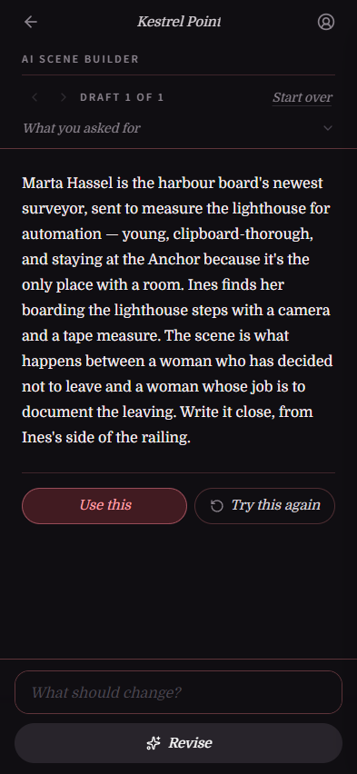
  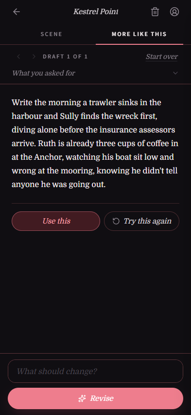
  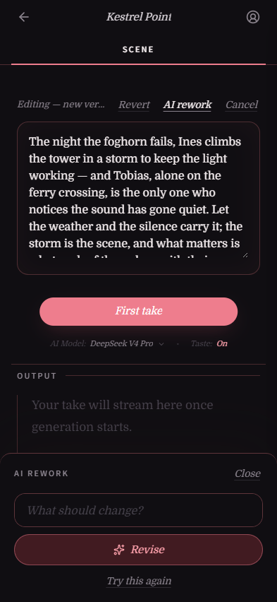
</p>

Scenes you keep rewriting are grouped as **versions** of one scene rather than piling up as near-duplicates in your list, so the list stays a list of ideas. You can open the version history, compare and switch.

### Reading

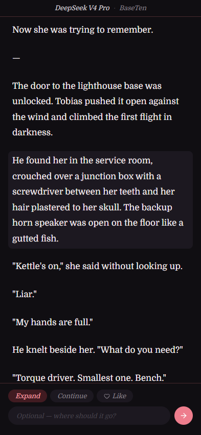

Generation streams live. While it runs you can slow it down, speed it up, pause, or skip to the end.

While reading or after it finishes:

- **Expand** — take the last stretch and let it breathe.
- **Continue** — keep going, optionally with a note on where it should go.
- **Re-run from a marker** — every expand and continue leaves a marker in the text; jump back to one and take a different path from there.

Reading display (font, size) is adjustable in place, and the app has a light and a dark mode.

A take is only saved when you say so. Saved takes hang off their scene, can be reopened and continued later, and can be edited by hand.

<br clear="all">

### Taste

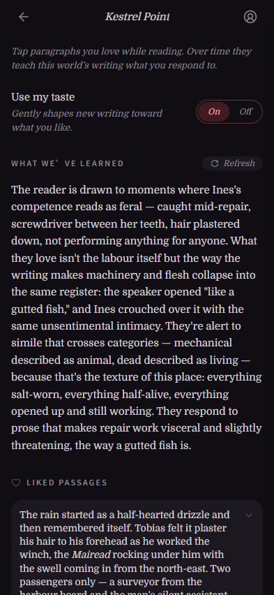

Tap a paragraph you love while reading and it's saved, optionally with a note about what got to you. Over time the app distills those into a short written profile of what you respond to **in that world**, and — when you switch it on — feeds it back into new writing. It's prose, not tags or ratings, and it lives per world, so what you like in one setting doesn't leak into another. You can read the profile, edit or delete individual likes, and refresh it whenever.

<br clear="all">

### Additions

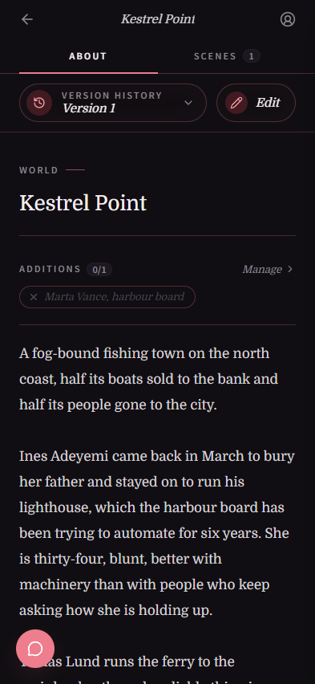

An addition is a piece of extra setting — a character, a relationship, a rule — kept beside the world rather than inside it. Switch one on and its text is appended to the world description for anything generated next; switch it off and the world reads as it always did.

Takes record which additions were on when they were written, and the scene list can narrow to what was written with the additions currently on.

<br clear="all">

### Versions of a world

A world's history works like branches. Editing a world edits it in place; **New version** saves your edits as a separate version and leaves the current one untouched. A version owns everything under it — its scenes, its takes, its likes, its additions — so switching versions swaps the whole world underneath you, and switching back restores it exactly.

### Ask

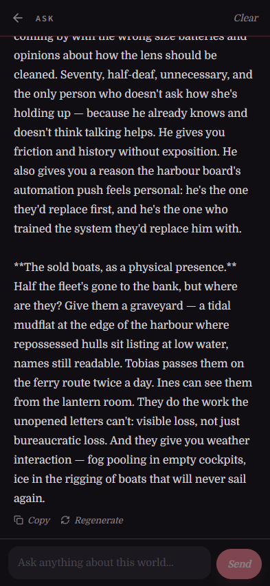

A chat, scoped to one world. Ask what the setting is missing, how a passage reads, how to word something. It's a conversation about the world, not a generator — your world is never changed by it.

<br clear="all">

### Finding things

Your scenes are searchable by free text (fuzzy, so you don't need the exact wording), and sortable by recent, oldest, most takes, or most rewritten. New accounts start with a few sample worlds to poke at; delete them whenever.

Elsewhere: the app is bilingual (English and Chinese, switchable at any time), and there are several models to generate with, chosen per generation.

### What it isn't

- **Not social.** No sharing, no discovery, no other people's content. Worlds are private to your account.
- **Not an archive.** Takes are saved and re-readable, but the app is built around the fresh read, not the shelf.
- **Not a "surprise me" button.** It rewards arriving with something you want.

### Running it

Bun is the runtime for both server and tooling.

```bash
bun install
bun run dev     # API on :3001, client on :5173
```

Needs `OPENROUTER_API_KEY` in the environment for generation and search embeddings. See `CLAUDE.md` for architecture and `DESIGN.md` for the design rules.

---
